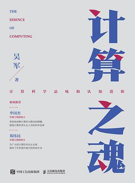
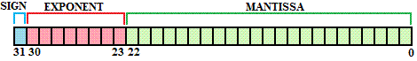
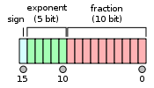
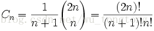

---  
share: true  
tags:  
  - notes  
  - reading  
  - books  
  - 人物  
  - 陪孩子读书  
  - todos  
  - 概念  
links:  
  - - ""  
date: 2022-09-17 21:47  
status: ⭕  
图片: https://img1.doubanio.com/view/subject/s/public/s34032260.jpg  
出版年: 2021-11  
作者: 吴军  
豆瓣评分: 9.3  
ISBN: 9787115576170  
---  
  
  
  
  
# 《计算之魂》   
---  
📌 吴军 ^e07c3e  
 > [!NOTE]+ 🗒️Abstract:  
 > [[2022-10-09]] 读完第一遍  
  
  
### 1. 计算的本质  
- 中国古代质量的计量使用的是十六进制（半斤=八两）；  
- 所以算盘🧮下面5颗珠子，上面2颗；  
- 任何能计算、有存储能力、受指令控制的机器都可以被称作计算机；  
  
#### 计算机的演进  
- 1642年，法国数学家帕斯卡发明了最早的机械计算机  
- 计算机在这个年代，寻求以复杂的方法解决复杂的问题，越做越复杂，复杂到无法实现；  
- 现代计算机的几个奠基人：用简单方法解决复杂问题  
- 布尔通过二进制将算术和数理逻辑进行了统一，提供了布尔代数；  
- 香农从理论上指出任何逻辑控制和计算都与开关电路等价；  
- 楚泽通过自己的实践证明了使用布尔代数可以实现任何十进制的运算；  
- 图灵：站在未来，为当前计算机的发展指明了路线和方向，定义了什么问题可以通过计算机解决，怎么解决，具体实现交给后人慢慢研究  
#### ❓可计算问题  
 > [!NOTE]+ 什么是计算机可以解决的问题？  
 > - 我们遇到的问题中只有一部分问题是数学问题（还有哲学问题、伦理问题等）  
 > - 数据问题中只有一部分问题是有确定性答案的（可判定与有答案：希尔伯特的第十个问题关于[[丢番图方程]]是否有解）  
 >   - 有确定答案的问题中，只有一部分可以转变成计算机的可执行程序，即可计算  
 >   - 所有的可计算问题中，只有一部分可以在有限的时间内容给出结果（工程可解）  
 >     - 人工智能目前可解决的问题（在这个很小的局部范围之中）  
  
![[../assets/img/Pasted image 20220918101826.png|500]]  
#### 图灵机   
本着模拟人类运算过程的想法，图灵机由以下 四个部分组成：  
① 无限长的纸带，被划分为连续的一个个格子，从左到右编号为 0 , 1 , 2 , ⋯ ，纸带对应人类运算时的纸张，在图灵机中，纸带长度是无限的，也就是说图灵机有着无限的存储容量；  
② 可以在纸带一维空间内自由移动的读写头，能够读取当前格中内容以及改变他们；  
③ 控制规则，根据图灵机当前状态与当前读写头读取到的内容确定读写头的动作，对应于人类计算时记忆的运算规则；  
④ 状态寄存器，用于保存图灵机当前所处的状态，当遇到特殊状态 —— 终止状态时机器停止，根据终止状态具体是成功状态还是失败状态来给出对应结果。  
  
#### 与非转布尔运算  
![[../assets/img/Pasted image 20220918104055.png|500]]  
### 2. 大O的复杂度计算   
- #人物 图灵提出了计算机的数学模型，冯诺依曼确定了计算机的通用系统结构，高德纳则奠定了计算机算法的基础；  
- [[高德纳]] #人物   
- 计算机分析算法的鼻祖，提出评估计算机算法的标准；  
- 编写了计算机科学领域的圣经——《计算机程序设计艺术》  
- 迄今为止最年轻的图灵奖得主（35岁）  
- Tex的作者  
- 整个宇宙中基本粒子个数在 $10^{79}...10^{83}$ 之间；  
- [[葛立恒数]]是当前数学上可以证明的存在的最大的数，无法用科学记数法表示；  
- 排序算法的理论复杂度不可能小于 $O(Nlog(N))$。  
  
  
#### 蒂姆排序  
- 结合了[[数据结构与算法之美#插入排序|数据结构与算法之美 > 插入排序]]和[[数据结构与算法之美#归并排序|数据结构与算法之美 > 归并排序]]，实现了稳定的$O(Nlog(N))$的工业级排序算法；  
- 充分利用了现实世界很多数据内部有多个排好序的小片段（run）；  
- 对于长度小于某个值的run，插入排序扩展之；  
- python、Java和安卓操作系统的内置排序算法；  
  
### 3. 从递推到递归  
#### 计算思维  
- 计算机使用的是一种自顶向下、先全局后局部的逆向思维，被称为递归；  
- 人习惯使用的是自底向上、从小到大的正向思维，被称为递推；  
- [i] 理解递归，关键从整体出发，找好规律性，构建递归公式；  
- [？] 汉诺塔问题是一个典型的完全二叉树遍历过程，先遍历最左边的，再完成中间一步的移动，再遍历最右边的；  
#### 树  
1. 每个节点有唯一的父节点；  
2. 连通性（否则是森林）；  
3. 不带有环。  
- 任何树都和二叉树等价：  
- 对于树中每一个节点，将其子树中的第一棵变为左子树；  
- 将它右边的兄弟子树变为右子树。  
  
### 4. 编码——抽象与表示  
- 传统的人类编码主要考虑好记；计算机强调的是高效；  
- 人们生活中常用的编码都是从具体到抽象慢慢地演化出来的；  
- [i] IPV4 能够为40亿服务器提供编号；  
- [ ] 要习惯利用二进制对各种信息和对象进行编码；  
  
 > [!NOTE]+ 香农信息熵  
 > $$H=-\sum_{i=1}^np_ilogp_i$$  
 >   
   
- [I] 思维模式： 🐭试药的题目提醒我们计算机中很多问题，可以通过二进制编码，节省很多冗余的操作；  
  
#### 精度和范围  
- **a×10^b**  
- 编码长度和精度折中；  
##### 单[精度](https://so.csdn.net/so/search?q=%E7%B2%BE%E5%BA%A6&spm=1001.2101.3001.7020)浮点存储方式  
  
1位符号位s+8位指数位e+23位尾数位f，共32位，内存占4个字节，表示方式为(-1)^s * 2 ^(e - 127) * 1.f    
  
##### 半精度[浮点](https://so.csdn.net/so/search?q=%E6%B5%AE%E7%82%B9&spm=1001.2101.3001.7020)存储方式  
  
1位符号位+5位指数位+10位尾数位，共16位，内存占2个字节，表示方式为(-1)^s * 2 ^(e - 15) * 1.f    
  
INT8，八位整型占用1个字节，INT8是一种定点计算方式，代表整数运算，一般是由浮点运算量化而来。在二进制中一个“0”或者“1”为一bit，INT8则意味着用8bit来表示一个数字。因此，虽然INT8比FP16精度低，但是数据量小、能耗低，计算速度相对更快，更符合端侧运算的特点。(-128~127)  
  
#### 非线性编码和增量编码（差分编码）  
- 在编码时过滤掉冗余信息：视频中的差分编码，只有主帧有全编码，接着的帧使用增量编码；  
- 通常采用非线性编码来扩大范围，实现粗调；通过增量编码来缩短编码长度，完成精调；  
  
#### 哈夫曼编码  
- 常用的信息采用更简短的编码，节省编码空间；  
- 先将对象按照概率从小到大排序；  
- 然后逐步组合概率最小的两个对象，形成一棵二叉树；  
- 树的分支从根节点，上分枝为0，下分枝为1，赋值；  
- 每个对象的编码时从根结点到该位置的值；  
- [ ] 实现一下～  
  
#### 稀疏矩阵的表示  
  
1. 稀疏矩阵转变成三元组存储， 只存储非零元素，示例如下：  
  
| 行号   | 列号   | 元素索引   |  
| ---- | ---- | ------ |  
| 1    | 2    | 231    |  
| 1    | 3    | 123123 |  
| 2    | 1    | 111    |  
| 2    | 7    | 22     |  
  
2. 计算矩阵乘  
  
需要再建立一个按列的索引表：  
  
| 列号   | 行号   | 元素索引   |  
| ---- | ---- | ------ |  
| 1    | 2    | 111    |  
| 2    | 1    | 231    |  
| 3    | 1    | 123123 |  
| 7    | 2    | 22     |  
  
3. 进一步减少冗余，可以分表操作，将上面表格每个分为两张  
  
| 列号   | 元素索引   |  
| ---- | ------ |  
| 2    | 231    |  
| 3    | 123123 |  
| 1    | 111    |  
| 7    | 22     |  
  
和每行的非零元素起始位置信息表  
  
| 每一行的非零元素起始位置 |  
| ------------ |  
| 1            |  
| 4            |  
| 7            |  
  
> 每行的非零元素个数可以通过差值计算出来；由于按行排列的，可以顺序便利并利用这个偏移量进行计算，节约了大量荣誉的存储空间。  
  
### 5. 分类与组合  
  
#### 布隆过滤器（Bloom Filter）  
> 一个值通过多个hash函数，然后hash值所在的bit位置1，这样查询这几个hash位来判断是否存在，有一位不为1就可以认为该值肯定不存在，不为1有可能存在；  
- 可以作为数据库查询的前置环节；  
- 比Hash表更省空间；  
![[../assets/img/Pasted image 20220924201850.png|Pasted image 20220924201850.png]]  
#### B树及其变种  
- B+树  
	- 所有非叶子结点只保留键，所有内容都保留在叶子节点中；  
	- 用一个指针将所有的叶子节点从头到尾穿起来；  
	- 平衡运行时间和存储效率；  
- B* 树  
	- 在B+树的内部节点之间增加了指向兄弟节点的指针；  
	- Oracle数据库采用了B* 树的存储结构；  
- [[数据结构与算法之美#B-Tree|数据结构与算法之美 > B-Tree]]  
#### 卡特兰数   
  
$$  
C_n=C_{2n}^{n}-C_{2n}^{n-1}  
$$  
  
  
 > [!TIP]+ 卡特兰数的前几项值得  
 > 其前几项为（从第零项开始） : 1, 1, 2, 5, 14, 42, 132, 429, 1430, 4862, 16796, 58786, 208012, 742900, 2674440, 9694845, 35357670, 129644790, 477638700, 1767263190, 6564120420, 24466267020, 91482563640, 343059613650, 1289904147324, 4861946401452  
  
  
- 将大问题拆分成递归的子问题   
- 有限制的自由组合问题  
- 递推公式（k也有可能从0-(N-1)或从2-（N-1））：  
  
$$  
C(N)=\sum_{k=1}^{N-1}C(k)*C(N-k)  
$$  
  
- 递推代码  
```python  
def Catlen(n):  
    if n == 1:   
        return 1  
    else:  
        sum = 0  
        for i in range(1, n):  
            sum += Catlen(i) * Catlen(n-i)  
        return sum  
```  
- 典型问题  
	- 二叉树组合  
	- 完全二叉树组合  
	- 括号匹配问题   
		- 分一个括号中包含几个括号来区分不同的情况  
		- 包含和二叉树的分支是等价的  
	- 分割图形  
	- 进栈出栈  
		- 以最后一个谁出栈来切分   
  
### 6. 图论及其应用  
#### 图   
  
- #陪孩子读书 最近和依依在做数学奥数的举一反三，里面正好讲到了如何一笔画图：  
	- 柯尼斯堡的七座桥问题   
	- 统计每个点的出度，如果出度为奇数的点的数目为零或2，是可以通过一笔画成的；  
	- 如果出度为奇数的点数目为2，起点和终点分别为这两个奇数出度的点；  
#### 最大流问题  
- [?] 还有些不太好理解的地方：  #todos   
#### 二分图及最大匹配问题  
[[匈牙利算法|匈牙利双边匹配]]  
- 书中将其等价为最大流问题来解决；  
- [i] #概念 增广路径： 如果一条交替路的终点是未匹配点，那么这条交替路又称为增广路。  
	- [ ] 交替路：从一个未匹配点出发，依次经过非匹配边、已匹配边、非匹配边、已匹配边…形成的路径叫交替路。  
- [ ] 匈牙利算法的实质就是不断寻找新的增广路，然后对增广路径中的边进行**取反操作 (即非匹配边变成已匹配边，已匹配边变成非匹配边，因为增广路中非匹配边总是比已匹配边多一，故而取反后整个匹配中已匹配边数就多1)**，不断执行上述操作直到找不到增广路，说明此时达到了最大匹配。  
  
- [i] 匈牙利匹配算法的逻辑如下  
```python  
A = [0, 1, 2, 3]  
B = [0, 1, 2, 3]  
link = [[1, 0, 0, 1],  
        [1, 1, 0, 0],  
        [0, 0, 0, 1],  
        [0, 0, 0, 1]  
]  
matched =[-1 for i in range(len(B))] # B的反向记录  
  
def find(i, used)->bool:  
    "是否可以为 i 找到一个可匹配的B中的元素"  
    for b_idx in range(len(B)):  
          
        if not used[b_idx] and link[i][b_idx] == 1:  
            used[b_idx] = 1  
            if matched[b_idx] == -1 or find(matched[b_idx], used): # 回溯，调整已匹配的对象  
                matched[b_idx] = i  
                return True  
    return False  
  
def match(A, B, link):  
    count = 0  
    for i in range(len(A)): # 遍历A中的每个元素，寻找可匹配对象  
        used = [0 for i in range(len(B))] # i 是否占用了B中的某个节点  
        if find(i, used):  
            count += 1  
    return count  
  
```  
  
> 实际匈牙利的实现是通过矩阵变换实现的，可能效率更好，利用矩阵的一些计算特性。  
  
### 7. 分治思想  
- [I] `Divide and Conquer`  
	- [ ] 分治算法的核心在于分割与合并，而不在于递归；  
- [ ] Google MapReduce 的底层思想   
- [ ]  [[数据结构与算法之美#归并排序|数据结构与算法之美 > 归并排序]] 和 [[数据结构与算法之美#快速排序|数据结构与算法之美 > 快速排序]] 都采用了这个思想是算法复杂度由于 $O(N^2)$ 降低到 $O(NlogN)$。  
- [i] 用快速排序的思想解决求中值问题挺值得学习和思考的；  
- [ ] 矩阵乘法  
	- 一种是C1 ～ C10分到10个服务器上完成；每个服务器之间进行数据交换；  
	- 另一种是拆成100份，矩阵式的并行计算；各计算其中一小块；   
### 8. 理解存储  
- [i] 理解存储的两个维度  
	- [ ] 根据应用场景的需求选择合适的存储方式；  
	- [ ] 设计合理的存储层次结构，高效解决问题；  
#### 顺序与随机  
- [i] 顺序存储大规模数据读取效率高；硬盘和云存储是为顺序存储而设计的；  
- [i] 随机存储需要通过地址寻址，内存和高速缓冲适合随机存取；  
- [ ] 要想把顺序存储变成随机可访问，就需要设计合理的索引系统；  
	- [ ] 索引可以通过哈希表构建；  
	- [ ] 也可以通过顺序数组构建，用于范围检索；  
	- [ ] 但目前针对顺序搜索，没有很好的通用索引系统，比如在一定范围内查找信息；（二分查找）  
  
#### 存储层次结构  
- 以3.3GHz的英特尔i7四核处理器为例（峰值传输速率25GB/s）：  
	- L1缓存：64KB存储容量，一半用于存储指令，一半用于存储数据；  
		- 四个时钟周期完成一次数据访问 x 8路数据通道  
	- L2缓存：256KB的存储容量，不区分数据和指令：  
		- 十个时钟周期一次访问 x 8个通道；  
	- L3缓存：8M，被四个核心共用；  
		- 35个时钟周期 x 16个通道；  
	- 内存：  
		- 100个时钟周期以上；  
	- 硬盘：  
		- 10毫秒左右的数据准备时间（定位数据的寻道时间）  
-  一个时钟周期内电流只能走9cm，所以CPU的片上空间周围不可能放太多存储单元；  
- 缓存访问时间和容量开方成正比；  
- 32位处理器的寻址空间只有4GB，和地址线的数量有关，64位处理器64TB；  
  
## 9. 并行与串行  
- [i] 计算机的处理器不能直接对内存（包括缓存）中的数据进行操作，需要先加载到寄存器中；  
- [I] 取指-->分析指令-->执行指令-->读写数据   
- [i] 计算机之所以能够并行，是因为处理器在硬件上是并行的；  
- [i] 摩尔定律的两条分水岭的发展方向：  
	- [ ] 2000年之前，提高处理器性能的途径是提高工作频率、提高处理器的位数以及提高处理器的复杂度；  
	- [ ] 2016年以后，追求处理器单位能耗所提供的计算量，GPU、TPU兴起；  
## 10. 状态与流程  
- 考验的是抽象能力；